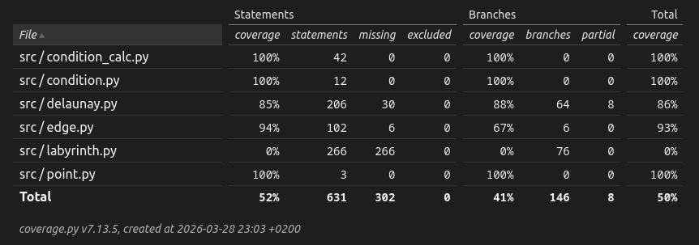

# Testaus

Testauksessa käytetään Pytestiä. 

(tähä jotain)

Testit voi ajaa komennolla `poetry run pytest`.

## Yksikkötestaus

Moduulin `edge` yksikkötestit testaavat, että (yksittäinen Edge oikein, quad-edgen yhteydet oikein, splice / connect / delete toimii oikein, ...)

(planar_graph testit testaa että luokka laskee perustapaukset oikein)

(condition)

(labyrinth)

## Invarianttitestaus

Suurelle tasoverkolle blaa blaa invariantteja joiden laskeminen vie paljon aikaa, joten blaa blaa erikokoisilla syötteillä erivaativille testeille

