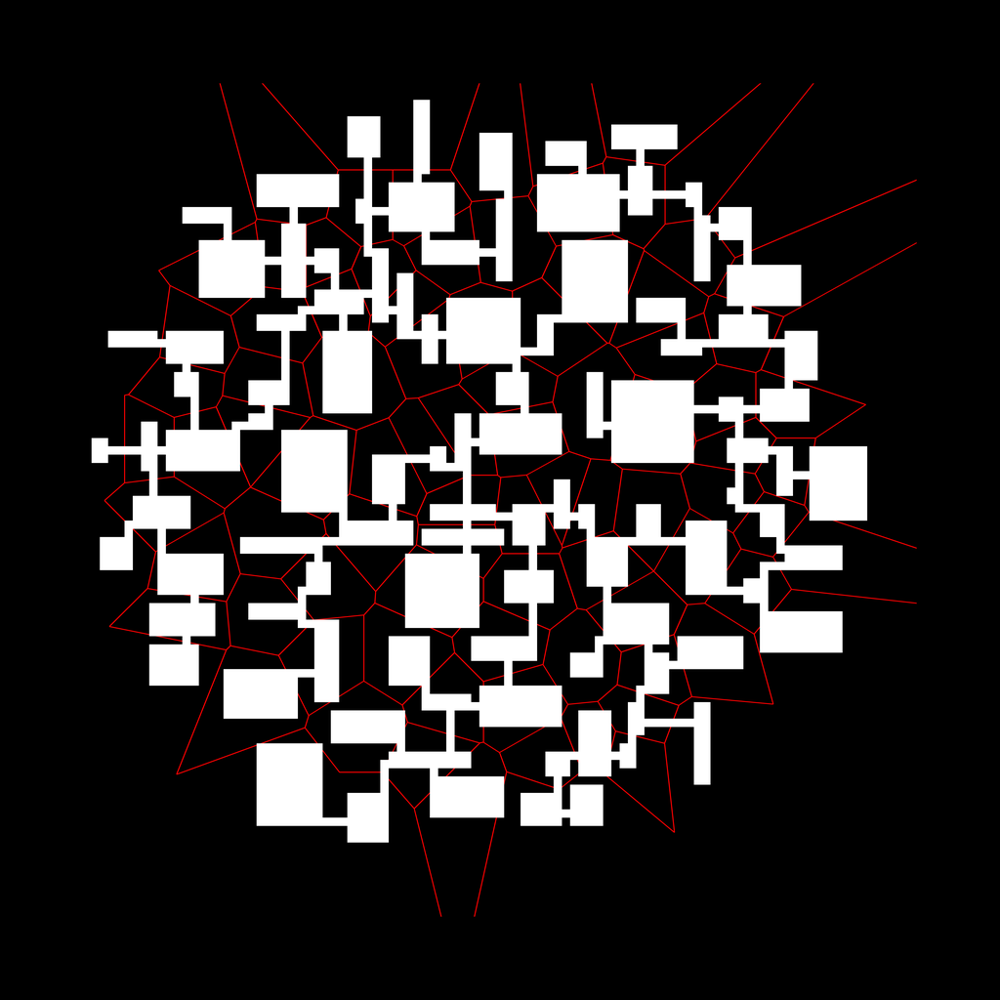

# Viikko 2

### Mitä olen tehnyt tällä viikolla?

Loin Edge ja Delaunay luokat. Koodasin algoritmin suoraan artikkelista. Ajattelin aluksi, että toteutan vain minimin mitä tarvitsee, mutta tarvitsin näköjään aika lailla kaikkea (paitsi orientaatiota). Huomasin että Numpyn determinantti ei ole riittävän tarkka kun pisteitä on monta ja sympy aivan liian hidas, joten käytän tällä hetkellä [C-kirjastoa](https://www.cs.cmu.edu/~quake/robust.html) CCW (orient2d) ja incircle testeille. 

Toteutin myös Voronoin diagrammin pisteiden laskennan, koska sain algoritmista samalla siihen kuuluvat sivut.

Koostin sivut listaan aluksi leveyshaulla, mutta se oli liian hidas (tai toteutin sen huonosti), joten nyt lisään sivut listaan algoritmin aikana. Päänvaivaa tuotti mm. että nyt piti pitää kirjaa myös poistetuista sivuista.

Toteutin pienimmän virittävän alipuun laskennan Primin algoritmilla. Pisteestä lähtevät sivut saa helposti `self.onext.onext.onext...`.

Tein alustavan Labyrinth-luokan (vaatii refaktorointia). En ole varma sen nykyisen reitinhakualgoritmin oikeellisuudesta. Huoneiden generoinnin parametrit ovat vielä vähän hakusessa.

Käytin aluksi NetworkX:ää kuvan piirtämiseen, vaihdoin nyt Pillowiin. Kirjoitin docstringeja Edge ja Delaunay luokille (teen koodin dokumentoinnin englanniksi ja muun suomeksi.)

Tein joitain yksikkötestejä ccw ja incircle testeille. Listasin itselleni muistiin jotain ideoita miten triangulaatiota voisi testata.

### Miten ohjelma on edistynyt?

Ohjelman peruspalikat ovat kasassa käyttöliittymää lukuunottamatta. Testaus on alkutekijöissään.

### Mitä opin tällä viikolla / tänään?
Opin paljon tasoverkoissa navigoimisesta, Pythonista, ja muista algoritmeista joita tarvitsin (Prim, jne.)

### Mikä jäi epäselväksi tai tuottanut vaikeuksia?

Käytin paljon aikaa yrittäessäni nopeuttaa algoritmia, mutta determinantin laskemisen ulkoistamisen lisäksi en ole keksinyt oikein mitään. Nyt 100k pisteen triangulaatiossa menee n. 17s.

Algoritmin (merge-osion) toimintaperiaate on vielä epäselvä. Toteutin artikkelin pseudokoodin Pythonilla heti alkuvaiheessa ja se on toiminut hyvin kirjoittaessani ohjelman muita osia.

Kysymyksiä:

Onko hyväksyttävä ratkaisu käyttää ulkoista kirjastoa incirclen laskemisessa?

Mitä osia ohjelmasta täytyy testata tarkasti?

Erityisesti, miten kattavasti Labyrinth-luokkaa pitäisi testata?

### Mitä teen seuraavaksi?

Keskityn kirjoittamaan yksikkö- ja integraatiotestejä näille: edge, condition, delaunay. Yritän päästä paremmin perille algoritmin toimintaperiaattesta. Ehkä pilkon Delaunay-luokan osiin.

### Aikaa meni
n. 25 tuntia? Olen tehnyt tätä hajanaisesti pitkin päivää melkein joka päivä, joten vaikea sanoa.

